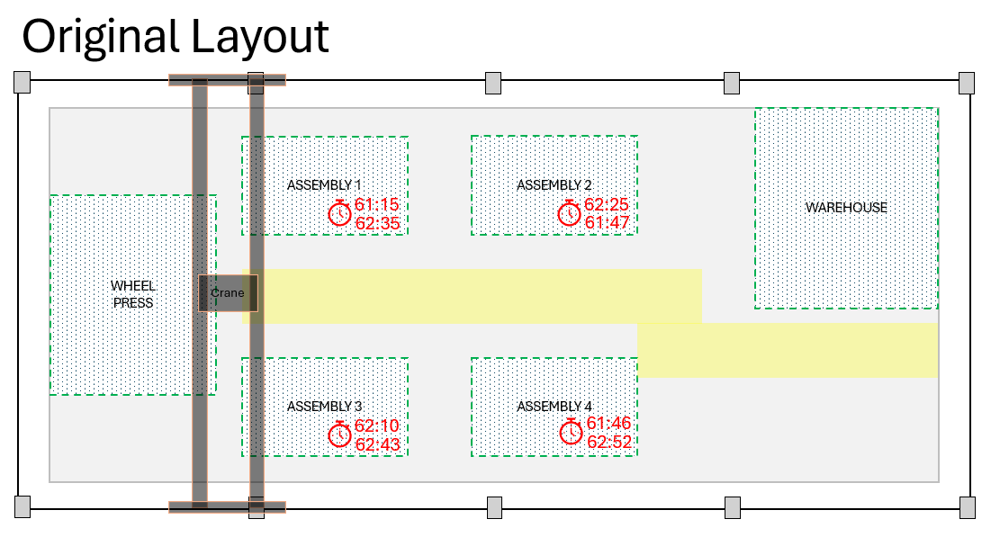
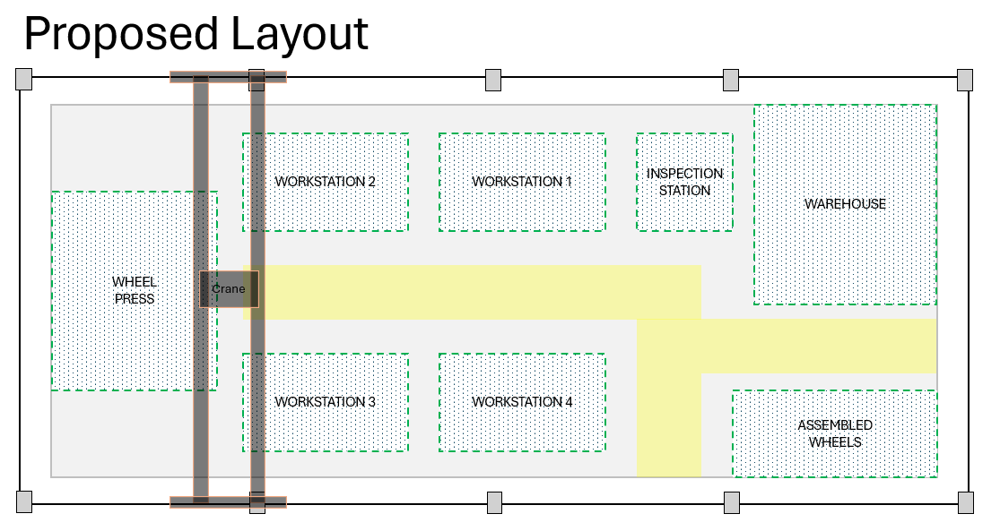

# Operations Engineer Simulation: Wheel Assembly Layout Proposal

## Project Overview

This project involves reconfiguring the wheel assembly section of the Aurora Express assembly line to address an identified bottleneck. The goal is to enhance efficiency and productivity in the manufacturing process. This README provides a comprehensive overview of the task, including the analysis of the current layout, the proposed new layout, and the justification for the changes.

## Task Instructions

### Step 1: Examine the Provided Layout
- **Objective**: Understand the current layout of the assembly line, particularly the wheel assembly section.
- **Action**:
  - Review the provided layout diagram.
  - Note the placement of equipment, workstations, and material flow paths.
  - Identify factors contributing to the bottleneck.

### Step 2: Analyze the Bottleneck Contribution
- **Objective**: Assess how the existing layout contributes to the bottleneck.
- **Action**:
  - Evaluate space utilization and identify constraints.
  - Analyze material movement and workflow inefficiencies.
  - Determine the impact of current layout on overall production.

### Step 3: Propose a New Layout
- **Objective**: Develop a reconfigured layout to alleviate the bottleneck.
- **Action**:
  - Sketch or illustrate a new layout for the wheel assembly section.
  - Ensure the proposed layout is feasible within the existing space.
  - Consider the proximity of related assembly processes to optimize material flow.

### Step 4: Justify the Proposed Layout
- **Objective**: Provide a rationale for the proposed layout changes.
- **Action**:
  - Detail how the new layout addresses the bottleneck.
  - Highlight expected improvements in efficiency, workflow, and worker productivity.
  - Discuss potential challenges in implementing the new layout and propose mitigation strategies.

### Step 5: Prepare the Presentation
- **Objective**: Create a PowerPoint presentation to communicate the proposed changes.
- **Action**:
  - Include slides analyzing the current layout and pinpointing limitations.
  - Add slides detailing the proposed layout with visuals/diagrams.
  - Summarize the changes, benefits, and possible implementation hurdles.
  - Use clear, concise bullet points and visuals to enhance the presentation.

## Analysis of Current Layout

- **Current Issues**: Identify specific areas where the current layout contributes to inefficiencies.
- **Diagram**: Include a diagram or flowchart of the current layout to visualize bottlenecks.

## Proposed Layout

- **New Layout Design**: Provide a detailed sketch or illustration of the proposed layout.
- **Key Changes**:
  - Reconfiguration of equipment and workstations.
  - Improved material flow paths.
  - Optimization of space utilization.

## Justification for Proposed Layout

- **Efficiency Gains**: Explain how the new layout improves production flow and reduces bottlenecks.
- **Workflow Improvements**: Detail how worker movements and material handling are optimized.
- **Productivity Increases**: Highlight expected increases in worker productivity and overall manufacturing output.
- **Challenges and Mitigation**: Discuss potential implementation challenges and strategies to mitigate them.

## Skills and Principles Applied
- **Manufacturing Layouts**: Understanding different types of layouts (fixed, process, product, cellular) and their applications.
- **Workflow Optimization**: Minimizing movement, balancing workload, and analyzing current layout for bottlenecks.
- **Process Analysis**: Mapping current process flow and using tools like Value Stream Mapping.
- **Simulation Modeling**: Testing different layout configurations using simulation software.
- **Cross-Functional Collaboration**: Engaging with various departments to ensure the new layout meets diverse needs.
- **Continuous Improvement**: Adopting a mindset of regular review and optimization of the layout.

