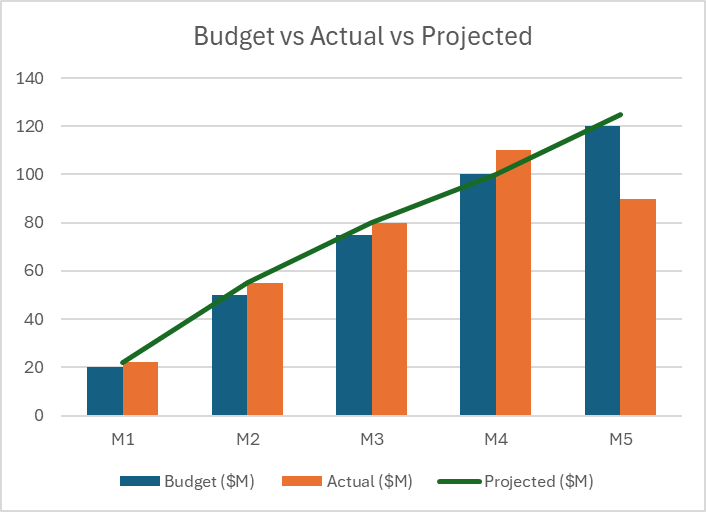
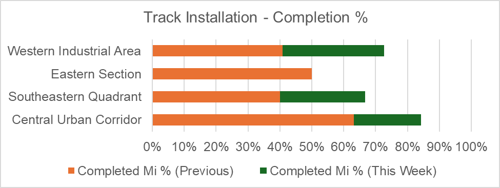

# Metroville Urban Rail Expansion Project

## Overview

The Metroville urban rail expansion project aims to enhance the city's rail infrastructure, addressing current issues and aligning with Metroville's environmental and community goals. This README outlines the strategies for KPI development, tracking, and visual presentation to effectively manage and communicate the project’s progress and success.

## Project Goals

- **Expand Connectivity**: Extend the rail network to underserved areas.
- **Enhance Efficiency**: Address overcrowding and integrate new lines with existing systems.
- **Promote Sustainability**: Improve air quality and increase green spaces.

## KPI Development

### Technical Feasibility

**1. KPI: Track Installation Rate**
- **Definition**: Measures the rate of track installation progress.
- **Measurement Method**: Track kilometers of rail laid per week/month.
- **Rationale**: Ensures construction milestones are met and provides insight into project pace.

**2. KPI: Electrification Progress**
- **Definition**: Tracks the percentage of rail electrification completed.
- **Measurement Method**: Percentage of electrified sections versus total planned electrification.
- **Rationale**: Assesses progress towards integrating sustainable energy solutions.

### Environmental Sustainability

**1. KPI: Air Quality Improvement**
- **Definition**: Measures the project's impact on local air quality.
- **Measurement Method**: Compare air quality metrics before and after project implementation.
- **Rationale**: Ensures alignment with environmental goals and contributes to reducing pollution.

**2. KPI: Green Space Enhancement**
- **Definition**: Quantifies the increase in green spaces as a result of the project.
- **Measurement Method**: Measure the area of new green spaces created or preserved.
- **Rationale**: Reflects the project's contribution to Metroville’s environmental objectives.

### Community Acceptance

**1. KPI: Community Feedback Score**
- **Definition**: Measures the community’s satisfaction with the project.
- **Measurement Method**: Analyze survey results and feedback from community meetings.
- **Rationale**: Ensures the project meets the needs and expectations of Metroville residents.

**2. KPI: Accessibility Improvement**
- **Definition**: Assesses the enhancement in accessibility and service quality.
- **Measurement Method**: Evaluate changes in transit times, station accessibility, and service coverage.
- **Rationale**: Measures improvements in transit efficiency and convenience for the community.

## Tracking in Rail Infrastructure Projects

### Types of Tracking

**1. Construction Progress Tracking**
- **Focus**: Physical progress of rail construction.
- **Key Metrics**: Kilometers of track laid, number of stations completed.
- **Purpose**: Ensures milestones are met and construction is on schedule.

**2. Budget and Cost Tracking**
- **Focus**: Financial aspects of the project.
- **Key Metrics**: Total budget vs. actual expenditure, cost variances.
- **Purpose**: Identifies financial risks and manages budget adherence.

**3. Quality Assurance Tracking**
- **Focus**: Adherence to quality standards and safety regulations.
- **Key Metrics**: Inspection pass rates, defects identified.
- **Purpose**: Guarantees the infrastructure’s safety and reliability.

**4. Stakeholder Engagement Tracking**
- **Focus**: Interactions with community and stakeholders.
- **Key Metrics**: Number of consultations, feedback received.
- **Purpose**: Maintains good relations and addresses community concerns.

**5. Environmental Impact Tracking**
- **Focus**: Project’s ecological footprint.
- **Key Metrics**: Emissions reduced, green spaces affected.
- **Purpose**: Ensures alignment with sustainability goals.

### Implementing Tracking Methods

**1. Project Management Software**
- **Use**: Real-time tracking of tasks, budgets, and timelines.
- **Example**: Microsoft Project, Asana.

**2. Regular Site Inspections and Audits**
- **Use**: Verify quality and compliance.
- **Example**: Scheduled inspections and quality checks.

**3. Stakeholder Meetings and Surveys**
- **Use**: Gather and address feedback.
- **Example**: Public meetings, online surveys.

**4. Environmental Impact Assessments**
- **Use**: Evaluate ecological effects.
- **Example**: Reports on emissions and ecological impacts.

## Visual Presentation Techniques

**1. Dashboard Design**
- **What It Involves**: Creating a central visual interface that displays key project metrics at a glance.
- **Techniques**: Use color coding to indicate status (green for on track, yellow for caution, red for delays), graphical indicators like progress bars, and minimal text to keep the dashboard uncluttered and focused.
- **Purpose**: Allows stakeholders to quickly assess project health and progress without delving into details.

**2. Infographics**
- **What It Involves**: Combining graphics, charts, and brief texts to tell the project story in an engaging and informative way.
- **Techniques**: Highlight key achievements, timelines, and stats with creative visuals and icons that are easy to understand. Balance textual information with imagery to enhance readability and retention.
- **Purpose**: Engages stakeholders with an appealing overview of project progress and highlights.

**3. Gantt Charts**
- **What It Involves**: Visualizing the project schedule and the relationship between tasks over time.
- **Techniques**: Use bars to represent task durations, color code for different phases or departments, and include milestones for major achievements. Tools like Microsoft Project or online platforms can automate Gantt chart creation.
- **Purpose**: Offers a clear timeline view, showing how tasks overlap and sequence, aiding in understanding project flow and deadlines.

**4. Maps and Geographic Visualizations**
- **What It Involves**: Using maps to represent geographic progress, especially relevant for infrastructure projects like rail expansions.
- **Techniques**: Overlay project data on city maps to show completed and in-progress sections, using symbols or colors to denote different types of work or challenges.
- **Purpose**: Provides a spatial context to project progress, helping stakeholders visualize where and how the project is unfolding within the city.

**5. Time-lapse Videos**
- **What It Involves**: Capturing the project's progress over time through regular photos or videos from the same viewpoint, compiled into a fast-motion sequence.
- **Techniques**: Ensure consistent framing and timing for capture sessions. Tools and apps can help stitch these sequences together.
- **Purpose**: Offers a dynamic and compelling view of progress, making it ideal for stakeholder presentations or social media updates.

### Enhancing Your Visual Presentations

**Clarity:**
- **Tip**: Avoid clutter; use simple visuals that communicate your message without overwhelming the viewer.

**Consistent Style:**
- **Tip**: Maintain a consistent color scheme, typography, and design style across all visuals to create a cohesive and professional appearance.

**Know Your Audience:**
- **Tip**: Tailor the complexity and focus of your visuals based on stakeholder needs—different groups may require different levels of detail.

## Skills and Principles Applied

### Data Analysis
- **Comparative Analysis**: Identifying trends over time to assess progress and potential issues.
- **Risk Identification**: Using quantitative and qualitative data to spot potential risks early.
- **Summarization Techniques**: Condensing complex information without losing critical insights.

### Project Management
- **Construction Progress Tracking**: Monitoring physical progress, ensuring milestones are met.
- **Budget and Cost Tracking**: Keeping financial aspects in check, comparing budgeted vs. actual costs.
- **Quality Assurance Tracking**: Ensuring adherence to quality and safety standards.
- **Stakeholder Engagement Tracking**: Monitoring interactions with the community and other stakeholders.
- **Environmental Impact Tracking**: Assessing and mitigating the project's ecological footprint.

### Visual Communication
- **Dashboard Design**: Creating intuitive and uncluttered visual interfaces.
- **Infographics**: Using graphics, charts, and brief texts for engaging storytelling.
- **Gantt Charts**: Visualizing project schedules and task relationships over time.
- **Maps and Geographic Visualizations**: Providing spatial context to project progress.
- **Time-lapse Videos**: Capturing and presenting dynamic views of project progress.

### Presentation Enhancement
- **Clarity**: Avoiding clutter and using simple, direct visuals.
- **Consistent Style**: Maintaining a cohesive appearance with consistent design elements.
- **Audience Awareness**: Tailoring visuals to the specific needs of different stakeholder groups.
